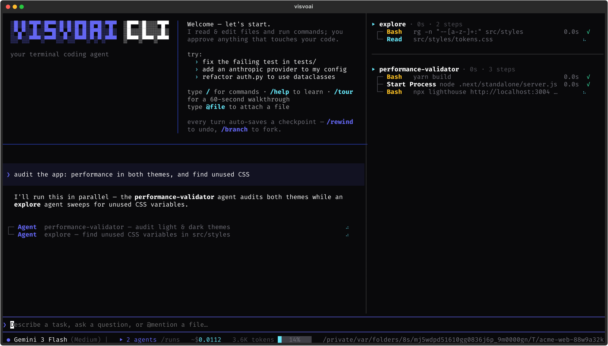
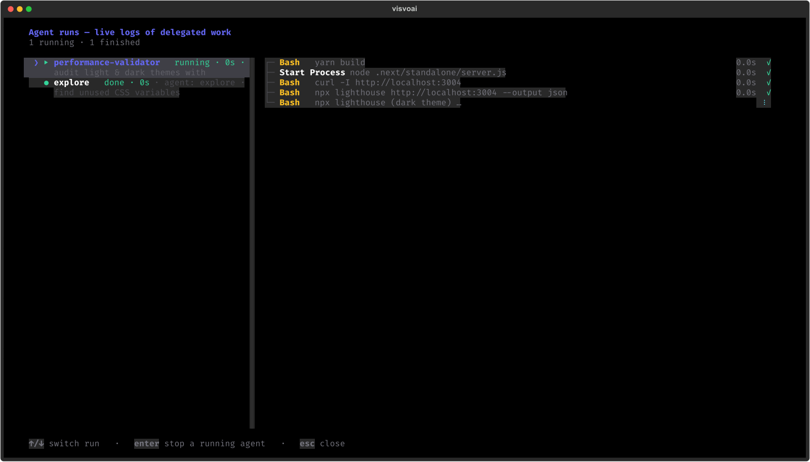
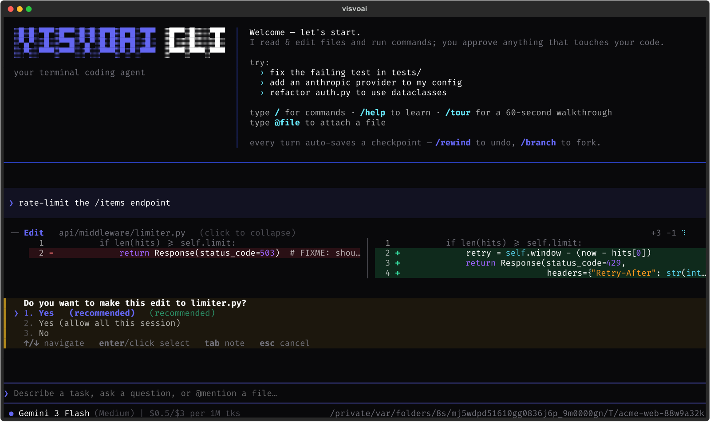
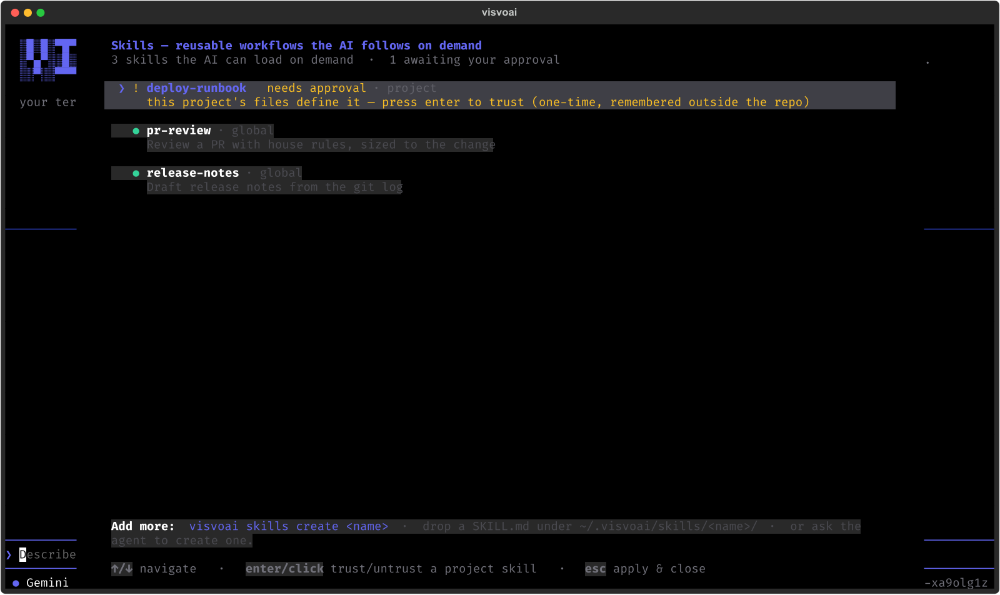

<p align="center"></p>

# visvoai-cli

**A terminal coding agent that takes permissions seriously.** *(VisvoAI™)*


Most coding agents hold real power over your machine, gated by nothing
stronger than a system prompt. This one is different: a full-screen TUI agent
(built on [Textual](https://textual.textualize.io/)) that reads, edits, and
runs code in your repo — with a permission model
enforced by the OS, not by politeness; delegatable subagents with live logs;
teachable skills; MCP; and per-turn time-travel across both your files and the
conversation.

```bash
pip install visvoai-cli
export GEMINI_API_KEY=...     # or ANTHROPIC_API_KEY / OPENAI_API_KEY / any compatible
visvoai
```

All provider integrations ship in the box — the model picker exposes a live
catalog (Gemini, Claude, GPT, Together, Groq, OpenRouter, …); you only supply
a key for the provider you use. `visvoai "fix the failing test"` runs a
single-shot turn without the TUI.

---

## Why this one

**The operating system enforces the rules, not the prompt.** Every shell
command is sorted into *read* or *write*. Reads (`ls`, `rg`, `git log`, …)
run instantly — inside an OS sandbox that cannot write to your disk (macOS
`sandbox-exec`, Linux `bwrap`). So a write pretending to be a read simply
fails; it cannot touch your files. Writes always ask you first. And if the
sorting is ever wrong, the sandbox still holds — a mistake costs a prompt,
never your data.

**Nothing from a downloaded repo turns itself on.** A repo can define
agents, skills, and MCP servers — but each one stays off until you approve
it once. If the file changes later, you are asked again (each file is
fingerprinted). What *you* define in your home directory is trusted as
yours. Cloning a repo can never silently give it power.

**Undo that includes your files.** Every turn saves a snapshot of your
working files. `/rewind` takes both the files *and* the conversation back to
any earlier point; `/fork` opens a past snapshot in a fresh directory so you
can try two ideas side by side.

## Agents & subagents

Delegate self-contained work; run dispatches in parallel; watch them live.

```markdown
<!-- .visvoai/agents/reviewer.md -->
---
description: Reviews a diff for bugs and risky changes
tools: read-only
---
You are a meticulous code reviewer. Examine the diff, read surrounding
context, and report concrete findings with file:line references.
```

- Built-ins ship ready: `explore` (read-only, parallel-friendly recon) and
  `general` (full toolset — its mutations still ask *you*).
- Each dispatch is an isolated conversation: own prompt, own tools, fresh
  history; only its final answer returns to the caller.
- **Live everywhere**: a side panel shows running agents' tool steps as they
  execute; `/runs` gives full logs with per-run stop; every dispatch persists
  a JSONL trace with tokens · cost · duration.
- Tool tiers are fixed at build time — an agent can't talk itself into more
  capability, and a read-only agent needs zero approval prompts to work.

## Skills

Teach a workflow once; the agent loads it when a request matches — index
first, full instructions on demand, referenced files only when the steps call
for them (progressive disclosure).

```markdown
<!-- ~/.visvoai/skills/release-notes/SKILL.md -->
---
description: Draft release notes from the git log
args:
  version: The version being released
---
1. Run `git log $version..HEAD --oneline`.
2. Group changes by type; see checklist.md for the house format.
```

Already have skill libraries? Point at them:

```toml
# ~/.visvoai/config.toml
[skills]
extra_dirs = ["~/.claude/skills", "~/dotfiles/skills"]
```

A skill grants knowledge, never capability — the agent follows the steps with
its own gated tools.

## MCP

```bash
visvoai mcp add chrome -- npx -y chrome-devtools-mcp@latest
visvoai mcp add linear --url https://mcp.linear.app/mcp \
    --header 'Authorization=Bearer ${LINEAR_API_KEY}'
```

Sessions are persistent, so stateful servers (a browser, a DB connection)
keep their state across calls. Secrets stay `${VAR}` references — never in
config files.

## Plugin tools

```python
# ~/.visvoai/tools/mytools.py
from visvoai.cli.toolkit import make_cli_tool

def jira_search(query: str, limit: int = 10) -> str:
    """Search our Jira and return matching issue keys."""
    ...

TOOLS = [make_cli_tool(jira_search, gate="approve")]
```

Schema from your type hints, description from the docstring, output capped,
exceptions returned as data, approval-gated by declaration. Global-only by
design — a repo can never inject Python into your session.

## API keys

Any of these, per provider — highest wins, nothing is ever committed:

1. **Environment** — `export GEMINI_API_KEY=…` (or `ANTHROPIC_API_KEY`,
   `OPENAI_API_KEY`, `GROQ_API_KEY`, … — the `{PROVIDER}_API_KEY` convention,
   including anything a local `.env` provides).
2. **Per-project** — `/login` in the TUI, or edit
   `<project>/.visvoai/secrets.toml` (`[api_keys]`); written `0600` and
   auto-added to the project's `.gitignore`.
3. **Global default** — `~/.visvoai/config.toml` (`[api_keys]`), used
   everywhere unless a project overrides it.

You need exactly one key to start; add more providers any time and the
`/model` picker lights them up.

## Living in it

| | |
|---|---|
| `/model` | live model catalog — pricing, thinking levels, per-conversation |
| `/agents` `/skills` `/mcp` | rosters + one-time trust approval |
| `/runs` | live subagent logs; stop one without killing the turn |
| `/rewind` `/branch` `/fork` | time-travel: files + conversation together |
| `/ps` | background processes the agent started (and the kill switch) |
| `/compact` | summarize older turns to reclaim context |
| `Shift+Tab` | approval mode: normal · auto-edit · accept-all |
| `@file` | attach a file; `Esc` stops the turn; full mouse support |

Costs and context are always visible: per-turn tokens/cost in the footer, a
context gauge that warns before you hit the wall.

## Gallery

| | |
|---|---|
|  |  |
|  |  |

Stills are generated, not staged by hand — `docs/make_stills.py` renders real
widgets and converts to PNG in one command, so they can't drift from the UI.

## From source

```bash
uv tool install --editable path/to/visvoai-cli
```

## Examples

Copy-paste configuration in [`examples/`](./examples/) — a reviewer agent, a
simple and a complex skill, plugin tools in all three shapes, and a
config.toml with MCP + external skill libraries.

## License

MIT
